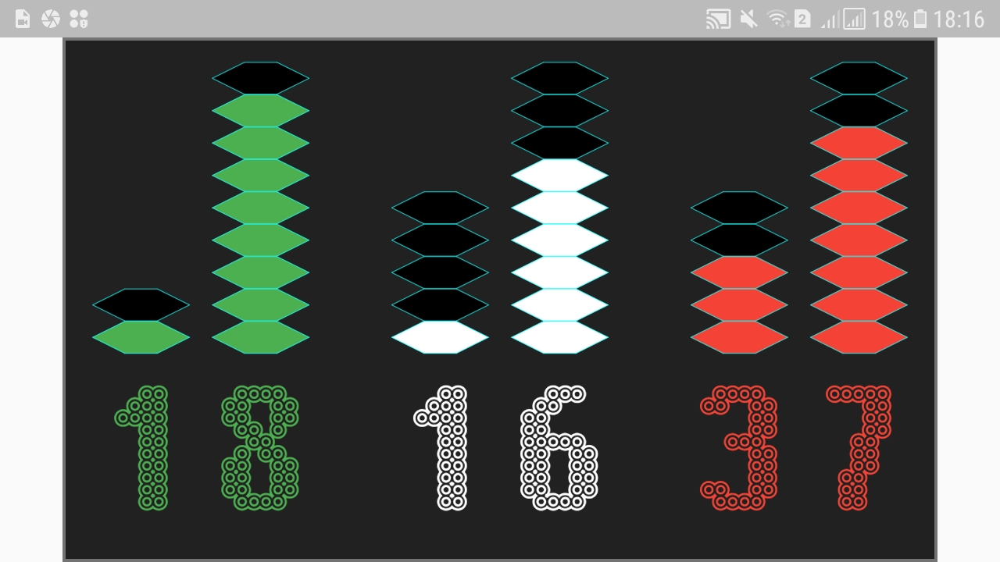
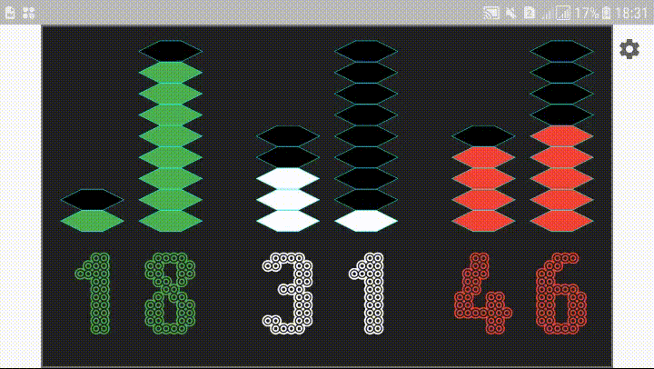

# Equalizer Clock

This app is an example of a digital clock (digital_clock folder).

It is a digital clock that allows displaying each digit of the clock in a form of an equalizer,

Taking into consideration the ones and the tens of seconds of minutes and of hours.

 

See equalizer Clock at link: https://equalizer-clock.firebaseapp.com/

